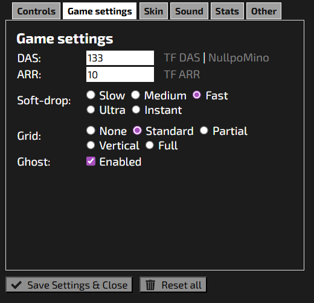

# Pose-Controlled Tetris

Play Tetris using your body! This script uses your webcam and MediaPipe pose detection to map body movements to Tetris controls.

## Controls

| Movement | Key | Adjustable Constant |
|---|---|---|
| Drop shoulders quickly | `Space` (hard drop) | `HARD_DROP_THRESHOLD` |
| Raise arms + drop hips | `↓` hold (soft drop start) | `SOFT_DROP_THRESHOLD` |
| Rise hips back up | `↓` release (soft drop end) | `RISE_THRESHOLD` |
| Extend right elbow out | `X` (rotate clockwise) | `HORIZONTAL_THRESHOLD`, `CLOSE_THRESHOLD` |
| Extend left elbow out | `Z` (rotate counter-clockwise) | `HORIZONTAL_THRESHOLD`, `CLOSE_THRESHOLD` |
| Raise left arm higher | `←` (move left) | `HIGH_THRESHOLD` |
| Raise right arm higher | `→` (move right) | `HIGH_THRESHOLD` |
| Bring both hands above head | `C` (hold piece) | `CLOSE_THRESHOLD` |

## Requirements

- Python 3.8+
- Webcam
- A running Tetris game window (e.g. [Jstris](https://jstris.jezevec10.com/), or any desktop Tetris)

## Installation

### 1. Install Python packages

```bash
pip install opencv-python mediapipe pyautogui
```

Or install from a `requirements.txt`:

```
opencv-python
mediapipe
pyautogui
```

```bash
pip install -r requirements.txt
```

### 2. Download the MediaPipe pose model

Download `pose_landmarker_lite.task` from the MediaPipe Models page and place it in the **same directory** as the script:

```
https://storage.googleapis.com/mediapipe-models/pose_landmarker/pose_landmarker_lite/float16/latest/pose_landmarker_lite.task
```

Using `curl`:
```bash
curl -o pose_landmarker_lite.task \
  "https://storage.googleapis.com/mediapipe-models/pose_landmarker/pose_landmarker_lite/float16/latest/pose_landmarker_lite.task"
```

## Usage

1. Open `https://jstris.jezevec10.com/?play=1&mode=2` in a browser and make sure its window is focused/active.
2. Under settings > 'Game settings' > 'Soft-drop', select 'Slow'. Then Save Settings & Close.

3. Run the script:

```bash
python main.py
```

4. A webcam window labelled **"Pose"** will open. Stand back far enough that your upper body and hips are visible.
5. Press **`Q`** to quit.

## Configuration

At the top of the script you can tweak these constants:

| Constant | Default | Description |
|---|---|---|
| `HARD_DROP_THRESHOLD` | `0.07` | How far shoulders must drop to trigger hard drop |
| `SOFT_DROP_THRESHOLD` | `0.07` | How far hips must drop to trigger soft drop |
| `RISE_THRESHOLD` | `0.07` | How far hips must rise to end soft drop |
| `CLOSE_THRESHOLD` | `0.05` | Proximity threshold for "hands together" (hold) and "hips together" (spin) |
| `HIGH_THRESHOLD` | `0.07` | How much higher one landmark must be than another (move left/right) |
| `HORIZONTAL_THRESHOLD` | `0.05` | Horizontal distance for elbow-out detection (spin) |
| `PROCESS_EVERY` | `10` | Process every Nth frame (lower = more responsive, higher CPU) |
| `DEBUG` | `False` | Show debug overlay with live landmark values |

Set `DEBUG = True` to display a real-time overlay showing which gestures are detected — useful for calibrating thresholds.

## Troubleshooting

**Script can't find the model file:**
Make sure `pose_landmarker_lite.task` is in the same directory as the script, or update `model_asset_path` in the script to the correct path.

**Keypresses aren't reaching the game:**
Click the Tetris window to focus it before or shortly after starting the script. `pyautogui` sends keypresses to the active window.

**On macOS**, you may need to grant Accessibility permissions to your terminal in System Settings → Privacy & Security → Accessibility.

**On Linux**, `pyautogui` may require `python3-xlib` or `python3-tk`:
```bash
sudo apt install python3-tk python3-xlib
```

**Gestures are triggering too easily / not triggering:**
Adjust the threshold constants in the script. Increase a threshold to make a gesture harder to trigger; decrease to make it easier.